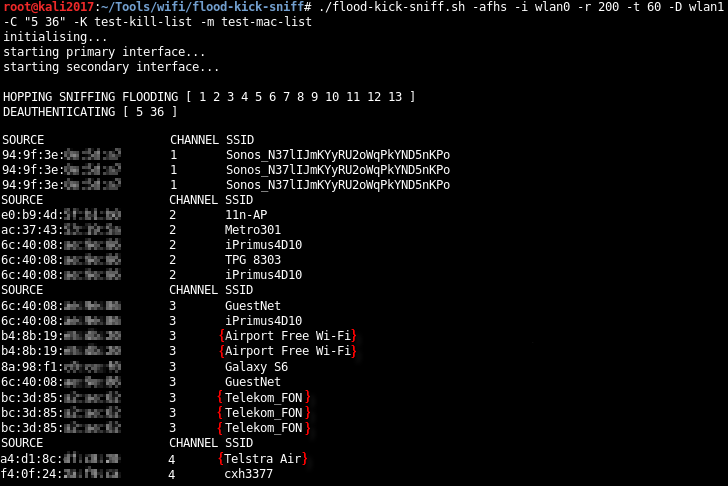

```
					 _______ __  __ _______ 
					|    ___|  |/  |     __|
					|    ___|     <|__     |
					|___|   |__|\__|_______|
```

this script is intended to be used in a Known Beacons attack, there is a very good explanation of this [here](https://census-labs.com/news/2018/02/01/known-beacons-attack-34c3/), including a comparison to the well known KARMA attack.

you can use this during wireless security testing to identify client devices that have OPEN networks saved in their preferred network list.

the script works as a wrapper for several other tools.
* interface 1 floods beacons with mdk3, sniffs probes with tshark, and hops channels with iwconfig
* interface 2 deauthenticates with mdk3 (channel hopping is handled by the mdk3 deauthentication option)

the 2 and 5 GHz ranges are hardcoded for use in Australia, so check [your local regulations](https://en.wikipedia.org/wiki/List_of_WLAN_channels) before running the script with default options.

### USAGE:

* identify the target ssid
* run airmon-ng to collect initial data
* run airparse.sh against the airmon-ng output to create a list of access point and client mac addresses
* run flood-kick-sniff.sh
  - deauth everyone from the target access points [interface 2]
  - flood beacons from a dictionary of well known ssids (Guest, Free Public WiFi, Airport Free Wi-Fi, SkyBus-Free-Wifi, etc.) [interface 1]
  - sniff for probe responses [interface 1]
* if a client probes for a ssid in the beacon list, then they have that named network in their preferred network list and are vulnerable to a rogue access point attack

```
# ./flood-kick-sniff.sh
usage: ./flood-kick-sniff.sh [-Ufhsx] [-i interface] [-c channel(s)] [-b file] [-u file] [-t number] [-I interface] [-C channel(s)] [-a file]

	-x		disable initialisation (airmon-ng check kill, ifconfig wlan0 down/up, etc.)

[*] interface 1
	-i <interface>	specify the primary interface for flooding / hopping / sniffing
	-c <channel(s)>	specify primary interface channel(s) (default = 2 GHz spectrum. "5ghz" = 5 GHz spectrum. "all" = all. list channels e.g. "1 3 7")
	-f		enable beacon flooding
	-h		enable channel hopping
	-s		enable probe sniffing
	-U		filter output for only clients in the client mac address list
	-r <number>	beacon flood rate per second (default = 50)
	-t <number>	time in seconds between channel hopping (default = 15)
	-u <file>	specify non-default client list (default is ./client-list)
	-b <file>	specify non-default beacon list (default is ./beacon-list)

[*] interface 2
	-I <interface>	enable deauthentication on specified secondary interface
	-C <channel(s)>	specify secondary interface channel(s)
	-a <file>	specify non-default ap list (default is ./ap-list)
	
example: ./flood-kick-sniff.sh -Ufhs -b /jobs/corp/beacon.list -c "1 3 5 7 9 11" -i wlan0 -u /jobs/corp/client.list -t 30 -r 25 -I wlan1 -C "1 6 11" -a /jobs/corp/ap.list
```



```
# ./airparse.sh
[*] run airodump-ng
# airodump-ng --channel 1-13,32-116,132-165 -w <output file> --output-format csv <interface>

[*] then run airparse.sh
# airparse.sh <airodump-ng output csv> <ssid>
```


###### TROUBLESHOOTING:

* hop channels [interface 1]. if a device saved a connection to a network on a specific channel, it will usually not respond to beacons for that network on different channels.
* use a shorter beacon list created from OPEN networks relevant to the area of testing.
* adjust the flood rate.

###### DEPENDENCIES:

* Aircrack-ng
* mdk3
* tshark

###### ACKNOWLEDGEMENTS:

[wifiphisher](https://github.com/wifiphisher/wifiphisher) for their known beacon list.
